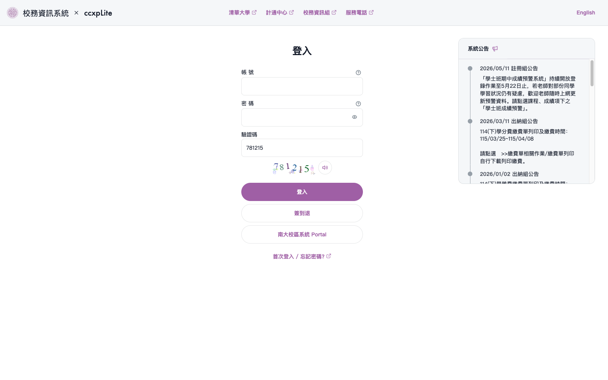
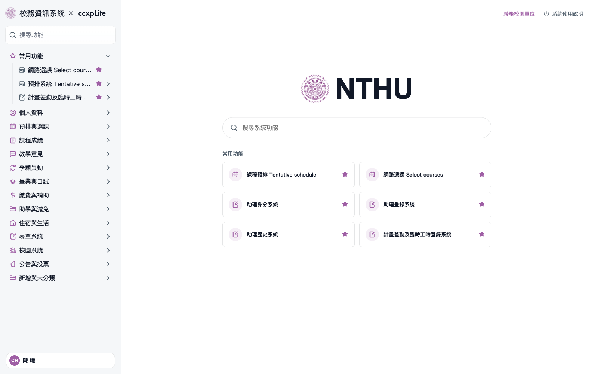

# ccxpLite


A lightweight browser extension that improves the usability and navigation experience of the NTHU Academic Information System (CCXP).

## Features

- Redesigned login page for improved usability and better announcement readability
- Automatic CAPTCHA solving for both CCXP login and OAuth verification (used in [eLearn](https://elearn.nthu.edu.tw/) and [eeclass](https://eeclass.nthu.edu.tw/)) with 99.95% and 98.79% accuracy respectively
- Faster access to frequently used functions with support for pinned functions and folders
- Two navigation layouts available: redesigned sidebar or full-screen menu
- Reduced visual clutter through saturation and texture suppression

## Installation

- [Google Web Store](https://chromewebstore.google.com/detail/glcnfmnbmknbphfgjgbokbbchahmiakk?utm_source=item-share-cb)
- [Firebox Add-ons](https://addons.mozilla.org/zh-TW/firefox/addon/ccxplite/)

## Demo

| Screen            | Original                                                                                                   | Sidebar Mode                                                                                                  | Menu Mode                                                                                               |
| ----------------- | ---------------------------------------------------------------------------------------------------------- | ------------------------------------------------------------------------------------------------------------- | ------------------------------------------------------------------------------------------------------- |
| Login             |                                |                                |                                |
| Main              |                                  |                                  |                                  |
| Category Expanded |                |                |                |
| Funtion Selected  |  |  |  |

## Decaptcha

The extension bundles decaptcha models from [ccxpDecaptcha](https://github.com/sago-cream/ccxp-decaptcha) and runs inference locally in the content script.

## Contributing

Contributions are welcome. Please read the [contribution guide](CONTRIBUTING.md) before opening a pull request. Report security and privacy issues according to our [security policy](.github/SECURITY.md).

## Batch work-hour registration

On the working-hours page (PE14D1.php), choose the task, department, and work description in the school's add form. Open the batch panel to select a date range, weekdays, additional dates, and one or more daily time slots. Preview the exact dates and times, uncheck exceptions, then start registration.

Weekly repetition expands into a list for this run; it does not schedule background submissions. Each batch supports up to 100 entries. The extension reloads available tasks for each date, preserves the school's validation and native Big5 submission, and stops when a response is rejected or cannot be confirmed. The stop button finishes an in-flight entry before stopping. Confirmed and uncertain entries are guarded in this tab's session storage; check school records before manually resubmitting uncertain entries.

Browser integration tests use simulated school responses and never submit real work hours:

```sh
bunx playwright install chromium
bun run test:browser
```
